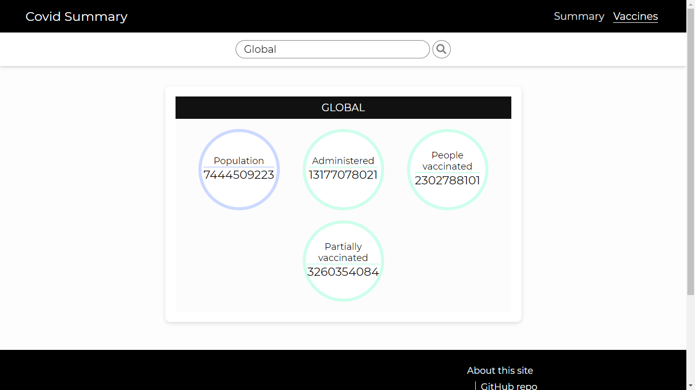
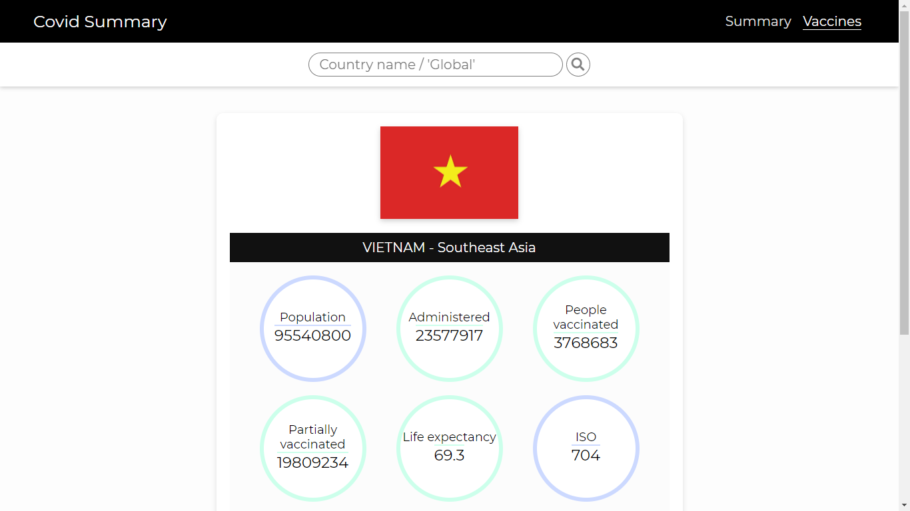

#  Covid Summary

> Summary of Covid-19 stats in countries.

### **[→ Covid Summary](https://nguyend-nam.github.io/Covid-Summary/)**

 

 

### Stats:
- Population
- Cases stats
- Vaccines stats
- Life expectancy
- ISO

